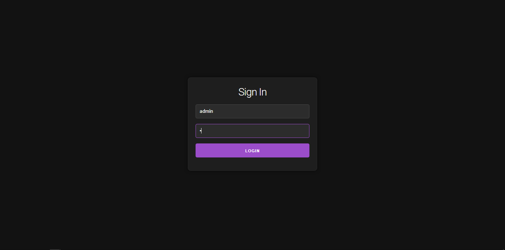

# NetMon: ESP32 WiFi Monitor Dashboard

**NetMon** is a smart network monitoring dashboard built with the ESP32 microcontroller. It shows Wi-Fi signal strength, internet connectivity, live time, and real-time weather updates. The device also creates its own Access Point for always-available access to a responsive web dashboard.

> 🎓 This project was developed as a **school project for CPE 502**.


[Download demo video](https://github.com/JohnPraise247/NetMon/raw/refs/heads/main/demo.mp4)

---

## Features

* **Wi-Fi Signal Visualization**
  5 LEDs indicate signal strength (from poor to excellent).

* **Internet Status LEDs**
  Green LED (Online), Red LED (Offline).

* **Live Time Sync via NTP**
  Formatted as 12-hour AM/PM clock.

* **Weather Monitoring**
  Uses [WeatherAPI](https://www.weatherapi.com/) to display location-based temperature and condition.

* **AP + STA Dual Mode**
  Automatically starts a Wi-Fi hotspot for fallback access (`SSID: NetMon`, `Password: 12345678`).

* **Mobile-Friendly Dashboard**
  View system status, weather, and time. Update settings like SSID/password and location.

* **Login Authentication**
  Protect settings with login (`admin` / `admin`).

* **Persistent EEPROM WiFi Storage**
  Saves credentials and attempts auto-reconnection on boot.

---

## Hardware Requirements

* ESP32 development board
* 7x LEDs
* 330Ω resistors
* ABS Wire Junction Box (100x68x50)
* PD140W USB C Female to Male Adapter
* Type C USB cable


**Pin Assignments:**

| Function             | GPIO               |
| -------------------- | ------------------ |
| Signal Strength LEDs | 17, 27, 26, 25, 33 |
| Internet OK (Green)  | 32                 |
| Internet FAIL (Red)  | 12                 |

---

## Screenshots

### Signin Page



### Dashboard


### Settings Page


---

## How to Setup

### 1. Install Libraries

Ensure these libraries are installed in the Arduino IDE:

* `WiFi.h`
* `WebServer.h`
* `HTTPClient.h`
* `ArduinoJson.h`
* `EEPROM.h`
* `SPIFFS.h`
* `esp_wifi.h`
* `time.h`

### 2. Upload Stylesheet to SPIFFS

Download [milligram.min.css](https://milligram.io/) and place it in a `/data` folder inside your sketch directory.

Then upload it to the ESP32:

* Install the [ESP32 Sketch Data Upload Tool](https://github.com/me-no-dev/arduino-esp32fs-plugin)
* Use **Tools > ESP32 Sketch Data Upload**

### 3. Edit Your Credentials

In the code:

```cpp
char ssid[32] = "SSID_NAME";
char pass[32] = "SSID_PASSWORD";
String weatherApiKey = "YOUR_API_KEY";
```

> Sign up for a free API key at [weatherapi.com](https://www.weatherapi.com/).

### 4. Flash the ESP32

Upload the code using Arduino IDE. Open the Serial Monitor to see logs.

---

## Accessing the Dashboard

* Connect your phone or PC to the `NetMon` hotspot (password: `12345678`)
* Open `http://192.168.4.1` in your browser
* Login using:

| Username | Password |
| -------- | -------- |
| `admin`  | `admin`  |

You can then:

* View signal strength and weather
* Update Wi-Fi SSID/Password
* Change location settings

---

## Project Info

* **Course**: CPE 502
* **Created by**: Group 2
* **Supervisor**: Prof.Olaniyan

---

## License

This project is licensed under the MIT License 
